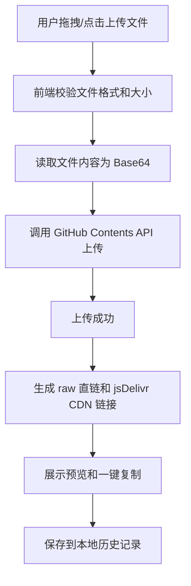

## 1. 产品概述

一个部署在 GitHub Pages 上的文件上传工具，用户上传图片、GIF、MP3、MP4 等文件后，工具通过 GitHub API 将文件存储到指定仓库，并生成可直接访问的 CDN 直链（jsDelivr / raw.githubusercontent.com）。

- **目标用户**：需要快速获取文件直链的开发者、博主、内容创作者
- **核心价值**：无需自建服务器，利用 GitHub 仓库作为免费图床/文件存储，一键生成直链

## 2. 核心功能

### 2.1 功能模块

1. **文件上传区**：拖拽或点击上传，支持图片（PNG/JPG/WebP/SVG）、GIF、MP3、MP4 等格式
2. **预览与链接生成**：上传成功后即时预览文件，展示直链并支持一键复制
3. **GitHub 配置面板**：配置 GitHub Token、仓库名、存储路径
4. **上传历史记录**：本地存储已上传文件信息，方便回溯

### 2.2 页面详情

| 页面名称 | 模块名称 | 功能描述 |
|---------|---------|---------|
| 主页 | 文件上传区 | 拖拽/点击上传，支持多文件，显示上传进度 |
| 主页 | 预览区 | 图片/GIF/视频/音频预览，文件信息展示 |
| 主页 | 链接展示区 | 显示直链URL，一键复制按钮，支持 raw 和 jsDelivr 两种链接 |
| 主页 | 配置面板 | GitHub Token、Owner、Repo、分支、路径配置 |
| 主页 | 历史记录 | 展示最近上传的文件列表，可重新复制链接 |

## 3. 核心流程

## 4. 用户界面设计

### 4.1 设计风格

- **主题**：暗色科技风，深色背景搭配霓虹色点缀
- **主色调**：深灰黑背景 `#0d0d0d`，霓虹青 `#00f0ff` 作为强调色，紫罗兰 `#a855f7` 作为辅助色
- **字体**：标题使用 `Orbitron`（科技感），正文使用 `JetBrains Mono`（代码风格）
- **布局**：居中单栏布局，卡片式模块，毛玻璃效果
- **动效**：上传区域呼吸光晕动画，成功时霓虹闪烁，链接复制时脉冲反馈

### 4.2 页面设计概要

| 模块名称 | UI 元素 |
|---------|--------|
| 文件上传区 | 虚线边框拖拽区域，居中图标+文字，hover 时边框发光，drag-over 时背景变亮 |
| 预览区 | 图片/视频/音频原生预览，文件信息卡片（名称、大小、类型） |
| 链接展示区 | 输入框展示URL，复制按钮旁有霓虹色脉冲动画，提供 raw/jsDelivr 切换 |
| 配置面板 | 折叠式面板，表单输入框，Token 输入带遮罩，保存按钮 |
| 历史记录 | 列表展示，每项包含缩略图、文件名、日期、复制按钮 |

### 4.3 响应式设计

- 桌面端优先设计，最大宽度 720px 居中
- 移动端自适应，上传区域和卡片全宽

## 5. 技术约束

- 纯前端方案，部署到 GitHub Pages
- 使用 GitHub Personal Access Token 进行 API 认证（用户自行配置）
- 文件通过 GitHub Contents API 以 Base64 编码上传
- 链接生成：`https://raw.githubusercontent.com/{owner}/{repo}/{branch}/{path}` 和 `https://cdn.jsdelivr.net/gh/{owner}/{repo}@{branch}/{path}`