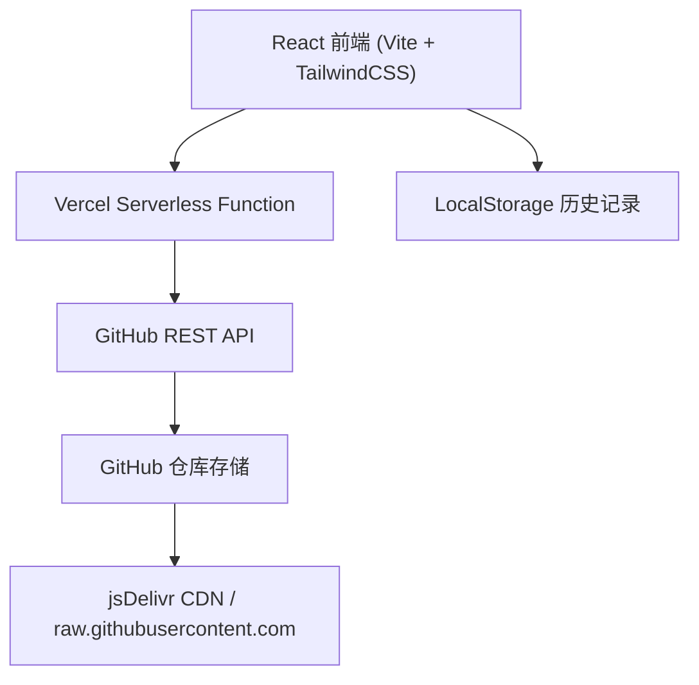

## 1. 架构设计



前端部署在 Vercel 静态托管，API 路由 `/api/upload` 和 `/api/config` 作为 Vercel Serverless Functions 运行。GitHub Token 通过 Vercel 环境变量注入，前端不接触敏感信息。

## 2. 技术说明

- **前端框架**：React@18 + TypeScript
- **样式方案**：TailwindCSS@3
- **构建工具**：Vite
- **状态管理**：zustand
- **图标库**：lucide-react
- **后端**：Vercel Serverless Functions（`@vercel/node` runtime）
- **部署平台**：Vercel（前端静态托管 + API Serverless）
- **存储**：localStorage（配置和历史记录持久化）

## 3. 路由定义

| 路由 | 用途 |
|-----|------|
| / | 主页，包含上传区、预览区、链接展示、配置面板、历史记录 |
| /api/upload | POST - 接收文件数据，通过 GitHub API 上传 |
| /api/config | GET - 检查后端 GITHUB_TOKEN 是否配置 |

## 4. API 定义

### 4.1 POST /api/upload

**请求体**
```typescript
interface UploadRequest {
  file: string;       // base64 编码的文件内容（不含 data: 前缀）
  fileName: string;   // 原始文件名
  fileType: string;   // MIME 类型
  owner: string;      // GitHub 用户名
  repo: string;       // 仓库名
  branch?: string;    // 分支名，默认 "main"
  path?: string;      // 存储子目录，默认 "uploads/"
}
```

**响应**
```typescript
interface UploadResponse {
  rawUrl: string;     // raw.githubusercontent.com 直链
  cdnUrl: string;     // jsDelivr CDN 链接
  filePath: string;   // 仓库中的文件路径
  fileName: string;   // 文件名
  fileType: string;   // MIME 类型
}
```

### 4.2 GET /api/config

**响应**
```typescript
interface ConfigResponse {
  configured: boolean;
  message: string;
}
```

## 5. 数据模型

### 5.1 前端配置模型

```typescript
interface GitHubConfig {
  owner: string;
  repo: string;
  branch: string;
  path: string; // 存储子目录，如 "uploads/"
}
```

### 5.2 历史记录模型

```typescript
interface UploadRecord {
  id: string;
  fileName: string;
  fileType: string;
  fileSize: number;
  rawUrl: string;
  cdnUrl: string;
  uploadedAt: string;
  thumbnailUrl?: string;
}
```

## 6. 组件结构

```
├── api/
│   ├── upload.ts          # Vercel Serverless: 文件上传
│   └── config.ts          # Vercel Serverless: 状态检查
├── src/
│   ├── components/
│   │   ├── DropZone.tsx
│   │   ├── FilePreview.tsx
│   │   ├── LinkDisplay.tsx
│   │   ├── ConfigPanel.tsx
│   │   ├── HistoryList.tsx
│   │   └── Header.tsx
│   ├── stores/
│   │   └── useStore.ts
│   ├── utils/
│   │   └── github.ts
│   ├── App.tsx
│   ├── main.tsx
│   └── index.css
├── vercel.json
└── vite.config.ts
```

## 7. 部署说明

### Vercel 部署步骤
1. 将项目推送到 GitHub 仓库
2. 在 Vercel 中导入该仓库
3. 设置环境变量：`GITHUB_TOKEN` = 你的 GitHub Personal Access Token（需要 `repo` 权限）
4. 部署即可

### 本地开发
```bash
# 启动前端开发服务器
npm run dev

# 需要同时启动 Vercel 开发服务器以支持 API 路由
vercel dev
```

## 8. 安全优势

- Token 仅存储在 Vercel 服务端环境变量中，前端代码完全不可见
- 前端不再需要处理任何敏感信息
- 用户无需在浏览器中配置 Token，降低泄露风险